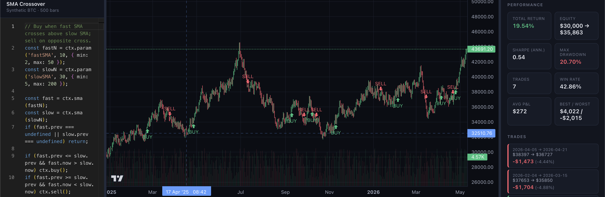
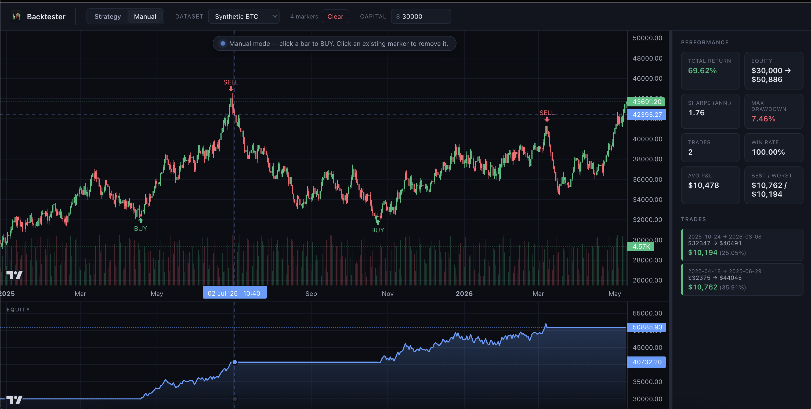
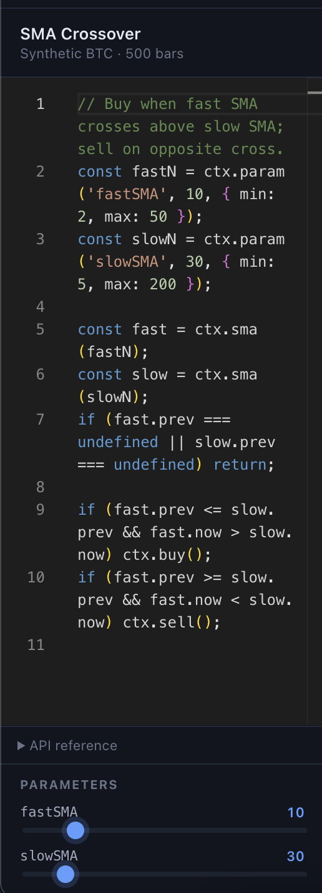
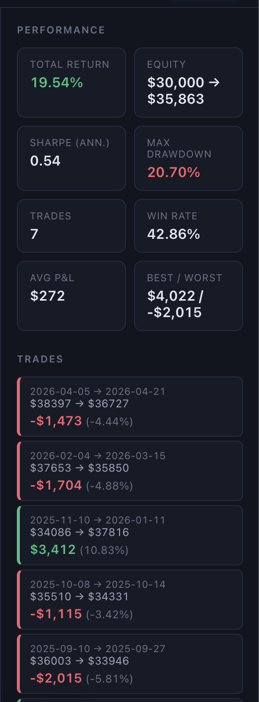

# Backtester

A browser-based trading-strategy backtester. Write strategies in JavaScript, run them against real or synthetic market data, see the results as candle charts, an equity curve, and the standard quant-finance performance stats.

> **Live demo:** [trading-strategy-backtester.netlify.app](https://trading-strategy-backtester.netlify.app)



---

## Highlights

- **Two modes.** _Strategy mode_ runs your code over historical bars. _Manual mode_ lets you click bars to enter discretionary trades.
- **Real data.** Daily/hourly/minute candles from Binance's public API (no auth) for BTC, ETH, SOL, BNB, XRP, DOGE, ADA, LINK. Plus synthetic data and CSV upload.
- **Configurable timeframes.** 1m / 5m / 15m / 30m / 1h / 4h / 1d / 1w. Paginated history up to 10,000 bars.
- **In-app code editor.** Monaco (the engine that powers VS Code) — syntax highlighting, autocomplete, multi-cursor, the works.
- **Auto-generated parameter sliders.** Strategies declare `ctx.param('fastSMA', 10, { min: 2, max: 50 })` and the UI renders a slider; dragging it re-runs the backtest in real time.
- **Save/load strategies.** Built-in presets (SMA Crossover, RSI Mean Reversion, Buy & Hold) plus your own, persisted to `localStorage`.
- **Sandboxed execution.** Each run happens in a Web Worker with a 5-second timeout — your infinite loops can't freeze the UI.
- **Synced charts.** Price + equity curve in stacked panes with mirrored crosshairs and time-axis pan/zoom.
- **Real performance metrics.** Total return, annualized Sharpe, max drawdown, win rate, average / best / worst trade, full trade log.
- **Resizable layout.** Drag the splitters; layout sticks across reloads.
- **Custom starting capital.** Set the bankroll you'd actually run the strategy with.

---

## Screenshots

### Manual mode — click bars to enter trades and watch the equity curve respond



### Strategy editor with auto-generated parameter sliders



### Live performance metrics and trade log



---

## Running locally

Requirements: Node 18+ (Node 20 recommended).

```bash
git clone <this-repo>
cd backtester
npm install
npm run dev
```

Then open the URL printed by Vite (typically `http://localhost:5173`).

To build for production:

```bash
npm run build
npm run preview   # serve the built dist/
```

---

## Writing a strategy

Each strategy is a JavaScript snippet that gets called once per bar. A `ctx` object is in scope:

| API | Description |
| --- | --- |
| `ctx.bar` | The current bar `{ time, open, high, low, close, volume }`. |
| `ctx.i` | Bar index (0-based). |
| `ctx.position` | `0` if flat, `1` if currently long. |
| `ctx.sma(n)` | Simple Moving Average; returns `{ now, prev, series }`. |
| `ctx.rsi(n)` | RSI 0–100; returns `{ now, prev, series }`. |
| `ctx.param(name, default, { min, max, step })` | Declare a tunable param. Auto-renders a slider. |
| `ctx.buy()` | Open a long position at this bar's close. |
| `ctx.sell()` | Close the long position at this bar's close. |

Example — SMA crossover:

```js
const fastN = ctx.param('fastSMA', 10, { min: 2, max: 50 });
const slowN = ctx.param('slowSMA', 30, { min: 5, max: 200 });

const fast = ctx.sma(fastN);
const slow = ctx.sma(slowN);
if (fast.prev === undefined || slow.prev === undefined) return;

if (fast.prev <= slow.prev && fast.now > slow.now) ctx.buy();
if (fast.prev >= slow.prev && fast.now < slow.now) ctx.sell();
```

Example — RSI mean reversion:

```js
const r = ctx.rsi(ctx.param('rsiPeriod', 14));
if (r.now === undefined || r.prev === undefined) return;
if (r.prev > 30 && r.now <= 30) ctx.buy();
if (r.prev < 70 && r.now >= 70) ctx.sell();
```

Strategies are sized **all-in / all-out** with a 0.1% fee per fill. Fills happen at the bar's close.

---

## Architecture

```
src/
├─ data/                 dataset adapters
│   ├─ binance.ts        public klines API w/ pagination
│   ├─ csv.ts            tolerant CSV parser
│   ├─ sample.ts         seeded synthetic BTC generator
│   └─ sources.ts        registry + loader
├─ engine/               pure backtesting logic
│   ├─ indicators.ts     SMA + RSI
│   ├─ signals.ts        crossover detection
│   ├─ portfolio.ts      simulator (cash, position, fees, equity curve)
│   ├─ stats.ts          return, Sharpe, drawdown, win rate
│   ├─ strategy-runner.ts  user-code runner, ctx, param registry
│   └─ runner.worker.ts  Web Worker entrypoint
├─ state/                persistence layers
│   ├─ strategies.ts     localStorage-backed strategy library
│   └─ manual.ts         localStorage-backed manual signals (per dataset)
└─ ui/
    ├─ Toolbar.tsx       top bar (mode, dataset, interval, params, capital)
    ├─ StrategyEditor.tsx Monaco wrapper
    ├─ ParamsPanel.tsx   auto-generated sliders
    ├─ ChartStack.tsx    candles + equity curve w/ synced crosshair
    ├─ StatsPanel.tsx    metrics + trade log
    └─ Splitter.tsx      drag-to-resize panel divider
```

### Why a Web Worker

User strategy code is `new Function('ctx', code)`. Compiling and running it inside the main React tree would let an infinite loop or runaway memory allocation freeze the UI. The worker runs in its own thread and can be `terminate()`'d after a 5-second timeout.

### Performance stats explained

| Metric | What it measures |
| --- | --- |
| **Total return** | `finalEquity / startEquity - 1`. Scale-invariant. |
| **Sharpe (ann.)** | `mean(daily log returns) / stdev(daily log returns) * sqrt(252)`. 1 ≈ decent, 2+ ≈ strong, 3+ ≈ suspicious. |
| **Max drawdown** | Worst peak-to-trough decline in equity. The "how much pain would you have endured" metric. |
| **Win rate** | Fraction of closed trades with positive P&L. |
| **Avg / best / worst trade** | Per-trade dollar P&L summaries. Useful for understanding the distribution beyond the win-rate average. |

Fee model: 0.1% of notional per fill. Fills are on the same bar as the signal (a small lookahead bias — see the [limitations](#known-limitations) section).

---

## Tech stack

- **React 19** + **TypeScript** + **Vite** for the app shell.
- [**lightweight-charts**](https://github.com/tradingview/lightweight-charts) for the price + equity charts.
- [**@monaco-editor/react**](https://github.com/suren-atoyan/monaco-react) for the code editor.
- **Zero external state-management deps** — plain `useState`/`useEffect` with `localStorage` for persistence.
- **Web Workers** (Vite's `new Worker(new URL(..., import.meta.url))` syntax) for sandboxed strategy execution.

---

## Deployment

A `netlify.toml` is included with `build = npm run build` and `publish = dist`. Connect the GitHub repo on [netlify.com](https://www.netlify.com/) and it deploys with no further configuration.

---

## Known limitations

- **Lookahead bias.** Signals are filled at the same bar's close that produced them; in reality you'd fill on the next bar's open. Effect is small for slow timeframes; noticeable for 1-minute strategies.
- **All-in/all-out sizing.** No position sizing (% of capital, Kelly, ATR-based), no partial fills.
- **No slippage model.** Real fills move the price; the simulator assumes you get the printed close.
- **One position at a time.** No shorting, no multi-asset portfolios.
- **No live trading.** This is a research tool. Do not wire it to a broker without significant additional safety work.

These are good "next features" if you want to extend the project.

---

## License

MIT.
